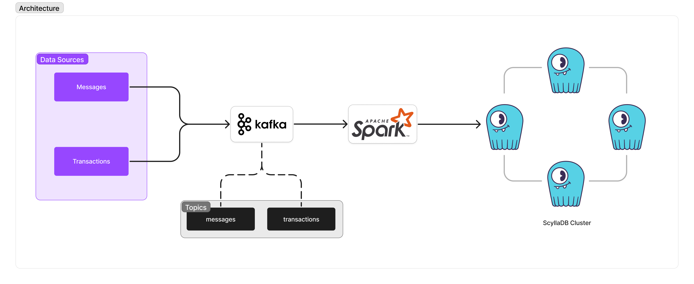
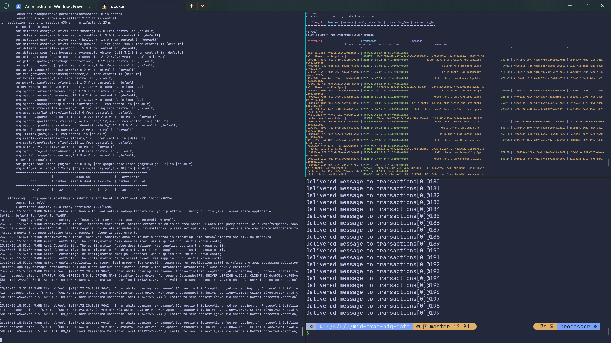

# Big Data Project





# Directory Structure

- `cmd` - contains the main entrypoint for the producer and data generation script
- `data` - contains the generated data
- `model` - contains the data model structs used in golang
- `processor` - contains the consumer code and integration with spark

# Tools

1. Docker
2. Golang
3. Python
4. Apache Kafka
5. Apache Spark
6. ScyllaDB

# Setup

Start the dependencies (Zookeeper, Kafka, and ScyllaDB)

```bash
docker-compose up -d
```

Create the kafka topics

```bash
chmod +x kafka_create_topics.sh
./kafka_create_topics.sh
```

Create the database keyspace and table (get schema from [here](init.cql))

```bash
docker exec -it scylla-node1 cqlsh

cqlsh> # copy and paste schema from init.cql
```

Install the consumer dependencies

```bash
pip install -r processor/requirements.txt
```

Start up the consumer

```
python processor/main.py
```

Finally, produce the messages

```bash
go run producer/main.go
```

Check the database if the data was inserted

```bash
docker exec -it scylla-node1 cqlsh

cqlsh> select * from integrated_citizen.citizen;
```

To generate new data run

```bash
go run generate_datasource/main.go
```

# References used

https://github.com/aldy505/local-scylladb-cluster/blob/master/docker-compose.yml

https://spark.apache.org/docs/latest/structured-streaming-kafka-integration.html

https://agam-kushwaha.medium.com/kafka-integration-with-apache-spark-d48e0691220f

https://medium.com/geekculture/integrate-kafka-with-pyspark-f77a49491087

https://levelup.gitconnected.com/using-kafka-with-docker-4520c2e6cfd

https://towardsdatascience.com/kafka-python-explained-in-10-lines-of-code-800e3e07dad1